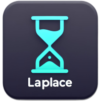

# ME : <p align="center">Engine-3D<br><br></p>

<p align="center">
    <h3 align="center">📦 Download &#xa0; : &#xa0;
    <a href="https://github.com/MasterLaplace/Engine-3D/releases/latest/">
        
    </a>&#xa0; | &#xa0;
    📜 License &#xa0; : &#xa0;
    <a href="https://github.com/MasterLaplace/Engine-3D/blob/main/LICENSE">
        
    </a>
    </h3>
</p>
<h3 align="center">🌐 Supported Platforms</h3>
<p align="center">
     &#xa0; | &#xa0;
     &#xa0; | &#xa0;
     &#xa0; | &#xa0;
    
</p>
<h3 align="center">🎮 Supported Graphics Libraries</h3>
<p align="center">
    <a href="https://www.sfml-dev.org/download/csfml/">
        
    </a> &#xa0; | &#xa0;
    <a href="https://www.sfml-dev.org/">
        
    </a> &#xa0; | &#xa0;
    <a href="https://www.opengl.org/">
        
    </a> &#xa0; | &#xa0;
    <a href="https://www.khronos.org/vulkan/">
        
    </a> &#xa0; | &#xa0;
    <a href="https://www.libsdl.org/">
        
    </a>
</p>
<h3 align="center">🚀 Supported Languages</h3>
<p align="center">
     &#xa0; | &#xa0;
    
</p>
<h3 align="center"> 🛠️ Build Status
<p align="center">
    <a href="https://github.com/MasterLaplace/Engine-3D/actions/workflows/test_engine.yml">
        
    </a>
</p>


## :placard: Table of Contents
- [Description](#description)
- [Goal](#goal)
- [Running](#running)
- [Docker](#docker)
- [Documentation](#documentation)
- [License](#license)
- [Contacts](#contacts)


<div id='description'/>

### :pencil: **DESCRIPTION**

Le but de ce projet est d’implémenter la méthode de rastérisation utilisé par de
nombreux moteurs 3D pour sa rapidité et ses possibilités comparé au Ray Tracing.<br>
Mon objectif final est de pouvoir proposer un rendu 3d graphique de n’importe quel
objet importé ainsi que de pouvoir me déplacer pour l’observer sous d’autres angles en
temps réel.<br>


<div id='goal'/>

### :bookmark: **Chapters**

1. [Rastérisation](./Docs/01_Rastérisation/Fiche%20Hub.pdf)
    - 1.1 Projection matricielle ✅
    - 1.2 Clipping de Cohen-Sutherland
    - 1.3 Déplacement de la caméra
    - 1.4 Texture mapping
    - 1.5 Z-buffer/Deph-buffer
2. [Collision](./Docs/02_Collision/Fiche%20Hub%202.pdf) (en cours)
    - 2.1 Binary Space Partitioning
    - 2.2 Octree
    - 2.3 Bounding Volume Hierarchy
    - 2.4 World Partitioning
    - 2.5 R-tree
3. [Compatibilité](./Docs/03_Compatibilité/Fiche%20Hub%203.pdf) (en cours)
    - 3.1 Langages
        - 3.1.1 C ✅
        - 3.1.1 C++
    - 3.2 Systèmes d’exploitation
        - 3.2.1 Linux ✅
        - 3.2.2 Windows
        - 3.2.3 MacOS
        - 3.2.4 FreeBSD
    - 3.3 Bibliothèques graphiques
        - 3.3.1 SDL
        - 3.3.2 CSFML ✅
        - 3.3.2 SFML
        - 3.3.1 OpenGL
        - 3.3.2 Vulkan
        - 3.3.3 DirectX
4. Outils de développement (a faire)
    - 4.1 Gestionnaire de version
    - 4.2 Gestionnaire de paquets
    - 4.3 Launcher ✅
    - 4.4 mode Debug
    - 4.5 Profiler
    - 4.6 Documentation ✅
    - 4.7 Tests
5. Optimisation (a faire)
    - 5.1 Multithreading
    - 5.2 SIMD
    - 5.3 Cache
    - 5.4 Mémoire
    - 5.5 GPU

Il faut : ✅

    0.1 dans un premier temps parser un fichier (.obj). ✅
    0.2 dans un second temps implémenter une Projection matricielle. ✅
    0.3 dans un troisième temps implémenter le Clipping de Cohen-Sutherland. ✅
    0.4 dans un quatrième temps ajout des déplacements de la caméra. ✅
    0.5 dans un cinquième temps implémenter le Texture mapping.
    0.6 dans un sixième temps implémenter un Z-buffer/Deph-buffer.


<div id='running'/>

### :truck: **RUNNING**

```shell
# Clone repository
$ git clone https://github.com/MasterLaplace/Engine-3D.git
$ cd Engine-3D

# Engine
$ make re
$ ./bin/engine.out <path-config-file.xml>

# Launcher
$ make re
$ ./launcher
```


<div id='docker'/>

### :whale: **DOCKER RUN**

```bash
# install docker on ubuntu
$ sudo apt-get update
$ sudo apt-get install docker-ce docker-ce-cli containerd.io

# check docker version (optional)
$ docker --version
> Docker version 24.0.6, build ed223bc

# build docker image
$ docker build -t engine-3d .

# run docker image
$ docker run engine-3d

# list docker images
$ docker ps

# stop docker image
$ docker stop <container-id>

# remove docker image
$ docker rm <container-id>
```


### INTERACTIONS

| Key | Action |
| --- | --- |
| <kbd>`Z`</kbd> | Move forward |


<div id='documentation'/>

### :wrench: **DOCUMENTATION**

Wiki:
- [**Technical Documentation & Wiki**](https://github.com/MasterLaplace/Engine-3D/wiki)

For detailed documentation on the Laplace Library, see:
- [**Laplace Library Documentation**](https://github.com/MasterLaplace/Engine-3D/blob/main/Libs/README.md)

External Documentation:
- [**CSFML**](https://www.sfml-dev.org/download/csfml/)
- [**vosk-api**](https://alphacephei.com/vosk/)
- [**GCC-C**](https://gcc.gnu.org/onlinedocs/)


## :rocket: LATEST RELEASE

> :clipboard: [Change Log](CHANGELOG.md).

- [](https://github.com/MasterLaplace/Engine-3D/releases/latest/)
- Release Date: **October 13, 2023**


<div id='license'/>

## :scroll: **LICENSE**

This project is licensed under the terms of the [MIT License](./LICENSE).

Copyright © 2023-2024 [Master_Laplace](https://github.com/MasterLaplace).


<div id='contacts'/>

### :mailbox_with_mail: **CONTACTS**

This project has been carried out by:

<table align="center">
    <tbody>
        <tr>
            <td align="center"><a href="https://github.com/MasterLaplace/"><br/><a href="https://github.com/MasterLaplace/"></a></td>
        </tr>
    </tbody>
</table>

---
<p align="center">ME.inc</p>